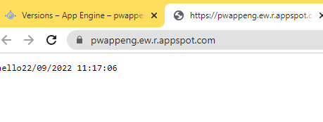

<!--Category:SQL,Powershell--> 
 <p align="right">
    <a href=""><a> 
    <a href="hhttps://github.com/ProductivityTools-Learning/ProductivityTools.Learning.GCP.DateApp"></a>
</p>
<p align="center">
    <a href="http://http://productivitytools.tech/">
        
    </a>
</p>

# GCP.DateApp

Very simple application which returns current date.


```python
from flask import Flask
from flask_restful import Api
from DateResource import DateResource
import os

def create_app():
    app=Flask(__name__)
    api=Api(app)
    api.add_resource(DateResource,'/')
    return app

if __name__ == "__main__":
    app = create_app()
    app.run(port=int(os.environ.get("PORT", 8080)), host='0.0.0.0', debug=True)
```


```python
class DateResource(Resource):
    def get(self):
        now = datetime.now();
        dts = now.strftime("%d/%m/%Y %H:%M:%S")
        dts="hello"+dts
        return Response(dts, mimetype="text/plain", direct_passthrough=True)
```

To use it on GCP AppEngine we need to create app yaml. 
```yaml
runtime: python310 # or another supported version

entrypoint: python app.py
```

To use the application in the Cloud build we need cloudbuild.yaml file
```
steps:
- name: 'gcr.io/google.com/cloudsdktool/cloud-sdk'
  entrypoint: 'bash'
  args: ['-c', 'gcloud app deploy']
timeout: '1600s'
```



